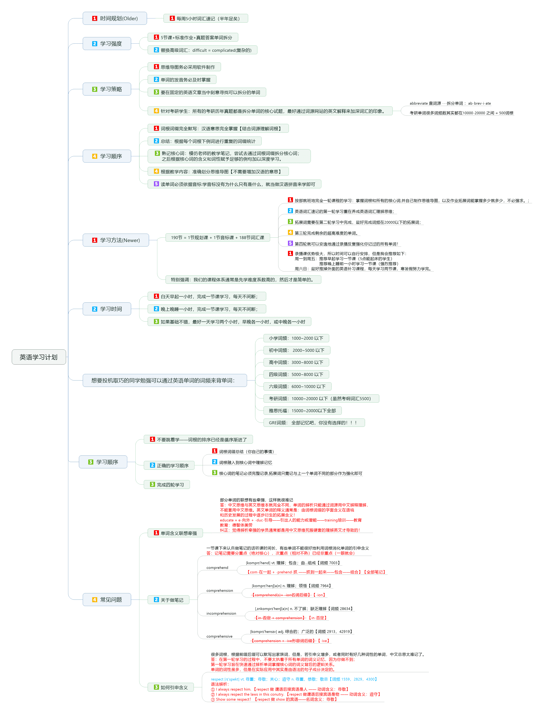
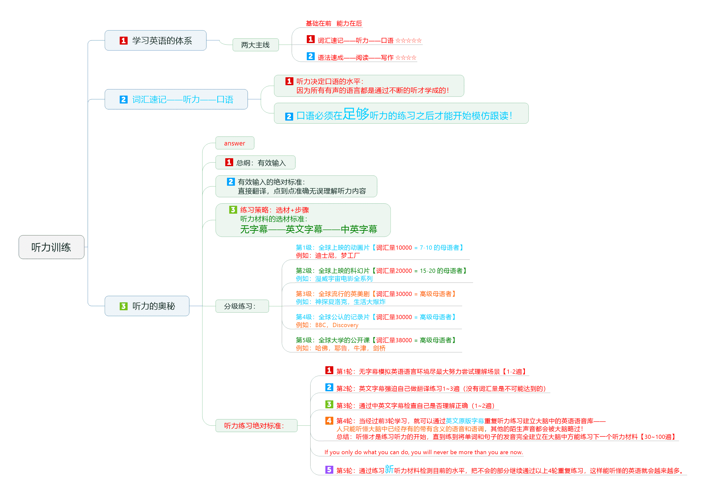

[简体中文](README.md) |  English  

    

##  Description
Hello, I'm  [Yan Yun Chang feng](https://yanyunchangfeng.github.io).
Meaning：combined Li Bai's famous frontier poem to take [Yan Yun Chang feng] - Long winds of tens of thousands of miles, belowing Yumenguan.

##  learning plan all one's life

    

  

##  listening training

    

##  Learning English Word
0.  [phonetic transcription](src/assets/img/lesson0.png)  | [phonetic transcription detail](src/assets/img/lesson0-detail.png)   
1.  [vinc](src/app/lesson1/lesson1-vinc.pdf)  |  [vinc-detail](src/app/lesson1/lesson1-detail-vinc.pdf)  
2.  [form1](src/app/lesson2/lesson2-form.pdf)  |  [form1-detail](src/app/lesson2/lesson2-detail-form.pdf)    
3.  [form2](src/app/lesson3/lesson3-form.pdf)  |  [form2-detail](src/app/lesson3/lesson3-detail-form.pdf)    
4.  [form3](src/app/lesson4/lesson4-form.pdf)  |  [form3-detail](src/app/lesson4/lesson4-detail-form.pdf) | [prehend](src/app/lesson4/lesson4-prehend.pdf)  |  [prehend-detail](src/app/lesson4/lesson4-detail-prehend.pdf)
5.  [struct](src/app/lesson5/lesson5-struct.pdf)  |  [struct-detail](src/app/lesson5/lesson5-detail-struct.pdf)  | [od](src/app/lesson5/lesson5-od.pdf)  |  [od-detail](src/app/lesson5/lesson5-detail-od.pdf)
6.  [bar1](src/app/lesson6/lesson6-bar.pdf)   |  [bar1-detail](src/app/lesson6/lesson6-detail-bar.pdf) 
7.  [bar2](src/app/lesson7/lesson7-bar.pdf)   |  [bar2-detail](src/app/lesson7/lesson7-detail-bar.pdf)  |  [via](src/app/lesson7/lesson7-via.pdf)   |  [via-detail](src/app/lesson7/lesson7-detail-via.pdf)  
8.  [script](src/app/lesson8/lesson8-script.pdf)   |  [script-detail](src/app/lesson8/lesson8-detail-script.pdf) |  [techno](src/app/lesson8/lesson8-techno.pdf)   |  [techno-detail](src/app/lesson8/lesson8-detail-techno.pdf) |  [press](src/app/lesson8/lesson8-press.pdf)   |  [press-detail](src/app/lesson8/lesson8-detail-press.pdf) 
9.  [rect1](src/app/lesson9/lesson9-rect.pdf)   |  [rect1-detail](src/app/lesson9/lesson9-detail-rect.pdf) 
10. [rect2](src/app/lesson10/lesson10-rect.pdf)   |  [rect2-detail](src/app/lesson10/lesson10-detail-rect.pdf)  |  [flux1](src/app/lesson10/lesson10-flux.pdf)   |  [flux1-detail](src/app/lesson10/lesson10-detail-flux.pdf) 
11. [flux2](src/app/lesson11/lesson11-flux.pdf)   |  [flux2-detail](src/app/lesson11/lesson11-detail-flux.pdf)  |  [st1](src/app/lesson11/lesson11-st.pdf)   |  [st1-detail](src/app/lesson11/lesson11-detail-st.pdf) 
12. [st2](src/app/lesson12/lesson12-st.pdf)   |  [st2-detail上](src/app/lesson12/lesson12-detail-st-prev.pdf) |  [st-detail2下](src/app/lesson12/lesson12-detail-st-next.pdf) 
13. [st3](src/app/lesson13/lesson13-st.pdf)   |  [st3-detail上](src/app/lesson13/lesson13-detail-st-prev.pdf) |  [st-detail3下](src/app/lesson13/lesson13-detail-st-next.pdf) 
14. [st4](src/app/lesson14/lesson14-st.pdf)   |  [st4-detail](src/app/lesson14/lesson14-detail-st.pdf) 
15. [st5](src/app/lesson15/lesson15-st.pdf)   |  [st5-detail](src/app/lesson15/lesson15-detail-st.pdf) 
16. [st6](src/app/lesson16/lesson16-st.pdf)   |  [st6-detail上](src/app/lesson16/lesson16-detail-st-prev.pdf) |  [st-detail6下](src/app/lesson16/lesson16-detail-st-next.pdf) 
17. [sit](src/app/lesson17/lesson17-sit.pdf)  |  [sit-detail上](src/app/lesson17/lesson17-detail-sit-prev.pdf) |  [sit-detail下](src/app/lesson17/lesson17-detail-sit-next.pdf) 
18. [pear](src/app/lesson18/lesson18-pear.pdf)  |  [pear-detail](src/app/lesson18/lesson18-detail-pear.pdf) |  [mov](src/app/lesson/lesson18-mov.pdf)  |  [mov-detail](src/app/lesson18/lesson18-detail-mov.pdf) 
19. [cover](src/app/lesson19/lesson19-cover.pdf)  |  [cover-detail](src/app/lesson19/lesson19-detail-cover.pdf) |  [plic1](src/app/lesson19/lesson19-plic.pdf)  |  [plic1-detail](src/app/lesson19/lesson19-detail-plic.pdf) 
20. [plic2](src/app/lesson20/lesson20-plic.pdf)  |  [plic2-detail](src/app/lesson20/lesson20-detail-plic.pdf) |  [mus](src/app/lesson20/lesson20-mus.pdf)  |  [mus-detail](src/app/lesson20/lesson20-detail-mus.pdf) |  [erg1](src/app/lesson20/lesson20-erg.pdf)  |  [erg1-detail](src/app/lesson20/lesson20-detail-erg.pdf) 
21. [erg2](src/app/lesson21/lesson21-erg.pdf)  |  [erg2-detail](src/app/lesson21/lesson21-detail-erg.pdf) |  [lect1](src/app/lesson21/lesson21-lect.pdf)  |  [lect1-detail](src/app/lesson21/lesson21-detail-lect.pdf) 
22. [lect2](src/app/lesson22/lesson22-lect.pdf)  |  [lect2-detail上](src/app/lesson22/lesson22-detail-lect-prev.pdf) |  [lect2-detail下](src/app/lesson22/lesson22-detail-lect-next.pdf) 
23. [nerv](src/app/lesson23/lesson23-nerv.pdf)  |  [nerv-detail](src/app/lesson23/lesson23-detail-nerv.pdf) 
24. [path](src/app/lesson24/lesson24-path.pdf)  |  [path-detail](src/app/lesson24/lesson24-detail-path.pdf)   |   [strict1](src/app/lesson24/lesson24-strict.pdf)  |  [strict1-detail](src/app/lesson24/lesson24-detail-strict.pdf)  
25. [strict2](src/app/lesson25/lesson25-strict.pdf)  |  [strict2-detail](src/app/lesson25/lesson25-detail-strict.pdf)  |  [vac](src/app/lesson25/lesson25-vac.pdf)  |  [vac-detail](src/app/lesson25/lesson25-detail-vac.pdf) |  [ple](src/app/lesson25/lesson25-ple.pdf)  |  [ple-detail](src/app/lesson25/lesson25-detail-ple.pdf) 
26. [medi](src/app/lesson26/lesson26-medi.pdf)  |  [medi-detail](src/app/lesson26/lesson26-detail-medi.pdf) |  [preci](src/app/lesson26/lesson26-preci.pdf)  |  [preci-detail](src/app/lesson26/lesson26-detail-preci.pdf) |[miss1](src/app/lesson26/lesson26-miss.pdf)  |  [miss1-detail](src/app/lesson26/lesson26-detail-miss.pdf) 
27. [miss2](src/app/lesson27/lesson27-miss.pdf)  |  [miss2-detail](src/app/lesson27/lesson27-detail-miss.pdf) 
28. [sci](src/app/lesson28/lesson28-sci.pdf)  |  [sci-detail](src/app/lesson28/lesson28-detail-sci.pdf) |  [liter](src/app/lesson28/lesson28-liter.pdf)  |  [liter-detail](src/app/lesson28/lesson28-detail-liter.pdf) |  [sum1](src/app/lesson28/lesson28-sum.pdf)  |  [sum1-detail](src/app/lesson28/lesson28-detail-sum.pdf)  
29. [sum2](src/app/lesson29/lesson29-sum.pdf)  |  [sum2-detail](src/app/lesson29/lesson29-detail-sum.pdf) |[spect1](src/app/lesson29/lesson29-spect.pdf)  |  [spect1-detail](src/app/lesson29/lesson29-detail-spect.pdf)  
30. [spect2](src/app/lesson30/lesson30-spect.pdf)  |  [spect2-detail上](src/app/lesson30/lesson30-detail-spect-prev.pdf) |  [spect2-detail下](src/app/lesson30/lesson30-detail-spect-next.pdf) 
31. [spect3](src/app/lesson31/lesson31-spect.pdf) | [spect3-detail](src/app/lesson31/lesson31-detail-spect.pdf) | [vis1](src/app/lesson31/lesson31-vis.pdf) | [vis1-detail](src/app/lesson31/lesson31-detail-vis.pdf) 
32.  [vis2](src/app/lesson32/lesson32-vis.pdf) | [vis2-detail](src/app/lesson32/lesson32-detail-vis.pdf) | [seri](src/app/lesson32/lesson32-seri.pdf) | [seri-detail](src/app/lesson32/lesson32-detail-seri.pdf) | [lat1](src/app/lesson32/lesson32-lat.pdf) | [lat1-detail](src/app/lesson32/lesson32-detail-lat.pdf) 
33. [lat2](src/app/lesson33/lesson33-lat.pdf) | [lat2-detail](src/app/lesson/lesson33-detail-lat.pdf) | [sim1](src/app/lesson33/lesson33-sim.pdf) | [sim1-detail](src/app/lesson33/lesson33-detail-sim.pdf)
34. [sim2](src/app/lesson34/lesson34-sim.pdf) | [sim2-detail](src/app/lesson34/lesson34-detail-sim.pdf)  |  [descip](src/app/lesson34/lesson34-descip.pdf) | [descip-detail](src/app/lesson34/lesson34-detail-descip.pdf) | [helic](src/app/lesson34/lesson34-helic.pdf) | [helic-detail](src/app/lesson34/lesson34-detail-helic.pdf)  |  [cept1](src/app/lesson34/lesson34-cept.pdf) | [cept1-detail](src/app/lesson34/lesson34-detail-cept.pdf)  
35. [cept2](src/app/lesson35/lesson35-cept.pdf) | [cept2-detail](src/app/lesson35/lesson35-detail-cept.pdf)  
36. [cept3](src/app/lesson36/lesson36-cept.pdf) | [cept3-detail](src/app/lesson36/lesson36-detail-cept.pdf)  
37. [cept4](src/app/lesson37/lesson37-cept.pdf) | [cept4-detail](src/app/lesson37/lesson37-detail-cept.pdf)  |   [sert](src/app/lesson37/lesson37-sert.pdf) | [sert-detail](src/app/lesson37/lesson37-detail-sert.pdf)  |   [duct1](src/app/lesson37/lesson37-duct.pdf) | [duct1-detail](src/app/lesson37/lesson37-detail-duct.pdf)  
38. [duct2](src/app/lesson38/lesson38-duct.pdf) | [duct2-detail](src/app/lesson38/lesson38-detail-duct.pdf)  |   [peri](src/app/lesson38/lesson38-peri.pdf) | [peri-detail](src/app/lesson38/lesson38-detail-peri.pdf) 
39. [scen](src/app/lesson39/lesson39-scen.pdf) | [scen-detail](src/app/lesson39/lesson39-detail-scen.pdf)  |   [journ](src/app/lesson39/lesson39-journ.pdf) | [journ-detail](src/app/lesson39/lesson39-detail-journ.pdf) |   [circ](src/app/lesson39/lesson39-circ.pdf) | [circ-detail](src/app/lesson39/lesson39-detail-circ.pdf)  
40.  [part1](src/app/lesson40/lesson40-part.pdf) | [part1-detail](src/app/lesson40/lesson40-detail-part.pdf)  
41.  [part2](src/app/lesson41/lesson41-part.pdf) | [part2-detail](src/app/lesson41/lesson41-detail-part.pdf)   |   [vent](src/app/lesson41/lesson41-vent.pdf) | [vent-detail](src/app/lesson41/lesson41-detail-vent.pdf)   |   [haust](src/app/lesson41/lesson41-haust.pdf) | [haust-detail](src/app/lesson41/lesson41-detail-haust.pdf)  
42.  [tra1](src/app/lesson42/lesson42-part.pdf) | [tra1-detail](src/app/lesson42/lesson42-detail-tra.pdf) 
43.  [tra2](src/app/lesson43/lesson43-part.pdf) | [tra2-detail](src/app/lesson43/lesson43-detail-tra.pdf)  |   [loc](src/app/lesson43/lesson43-loc.pdf) | [loc-detail](src/app/lesson43/lesson43-detail-loc.pdf)   |   [urb](src/app/lesson43/lesson43-urb.pdf) | [urb-detail](src/app/lesson43/lesson43-detail-urb.pdf)   |   [fortun](src/app/lesson/lesson43-fortun.pdf) | [fortun-detail](src/app/lesson43/lesson43-detail-fortun.pdf)   |   [torn](src/app/lesson43/lesson43-torn.pdf) |  [torn-detail](src/app/lesson43/lesson43-detail-torn.pdf)  
44. [noc](src/app/lesson44/lesson44-noc.pdf) | [noc-detail](src/app/lesson44/lesson44-detail-noc.pdf)  |   [proach](src/app/lesson44/lesson44-proach.pdf) | [proach-detail](src/app/lesson44/lesson44-detail-proach.pdf)  |   [gorg](src/app/lesson44/lesson44-gorg.pdf) | [gorg-detail](src/app/lesson44/lesson44-detail-gorg.pdf)  |   [arch](src/app/lesson44/lesson44-arch.pdf) | [arch-detail](src/app/lesson44/lesson44-detail-arch.pdf)  
45. [fess](src/app/lesson45/lesson45-fess.pdf)  |  [fess-detail](src/app/lesson45/lesson45-detail-fess.pdf)  |   [manu](src/app/lesson45/lesson45-manu.pdf) 45 |  [manu-detail](src/app/lesson45/lesson45-detail-fess.pdf)   |   [fasc](src/app/lesson45/lesson45-fasc.pdf)  |  [fasc-detail](src/app/lesson45/lesson45-detail-fasc.pdf)   
46. [viv](src/app/lesson46/lesson46-viv.pdf)  |  [fess-detail](src/app/lesson46/lesson46-detail-viv.pdf) |  [tact1](src/app/lesson46/lesson46-tact.pdf)  |  [tact1-detail](src/app/lesson46/lesson46-detail-tact.pdf) 
47. [tact2](src/app/lesson47/lesson47-tact.pdf)  |  [tact2-detail](src/app/lesson47/lesson47-detail-tact.pdf)   |   [liqu](src/app/lesson47/lesson47-liqu.pdf)  |  [liqu-detail](src/app/lesson47/lesson47-detail-liqu.pdf)   |   [pand](src/app/lesson47/lesson47-pand.pdf)  |  [pand-detail](src/app/lesson47/lesson47-detail-pand.pdf)   |   [mix](src/app/lesson47/lesson47-mix.pdf)  |  [mix-detail](src/app/lesson47/lesson47-detail-mix.pdf)     |   [electr1](src/app/lesson47/lesson47-electr.pdf)  |  [electr1-detail](src/app/lesson47/lesson47-detail-electr.pdf)   
48. [electr2](src/app/lesson48/lesson48-electr.pdf)  |  [electr2-detail](src/app/lesson48/lesson48-detail-electr.pdf)   |   [clud1](src/app/lesson48/lesson48-clud.pdf)  |  [clud1-detail](src/app/lesson48/lesson48-detail-clud.pdf)   
49.   [clud2](src/app/lesson49/lesson49-clud.pdf)  |  [clud2-detail](src/app/lesson49/lesson49-detail-clud.pdf) 

## Series Project

1. [NiceFish]( https://gitee.com/mumu-osc/NiceFish)：Mermaid, this is a microblogging system with a front end based on Angular 7.0 + PrimeNG 7.1.0（GVIP  gitee most valuable open source project 3192 ☆)
2. [NiceFish-React](https://github.com/damoqiongqiu/NiceFish-React)：This is the implementation of the React version, the interface looks exactly the same. Using React Hooks version 16.8.3, TypeScript, Ant Design component library, and Bootstrap v4.2.1 development.  (7 ☆)
3. [OpenWMS-Frontend](https://gitee.com/mumu-osc/OpenWMS-Frontend)：OpenWMS project with a front end based on Angular 7.0 + PrimeNG 7.1.0。  (Recommended 200 ☆)
4. [nicefish-spring-cloud](https://gitee.com/mumu-osc/nicefish-spring-cloud)：This is the server code for NiceFish, based on SpringCloud. Some basic functions have been completed, such as SpringSecurity+OAuth2+JWT to implement SSO, paged queries for articles, users, comments, etc. If you need to interface with this backend code, check out the for-spring-cloud branch of the project. (Recommended 117 ☆) 

## Social Homepage 

-  [Yan Yun Chang feng's github](https://github.com/yanyunchangfeng)  

## LICENSE

MIT