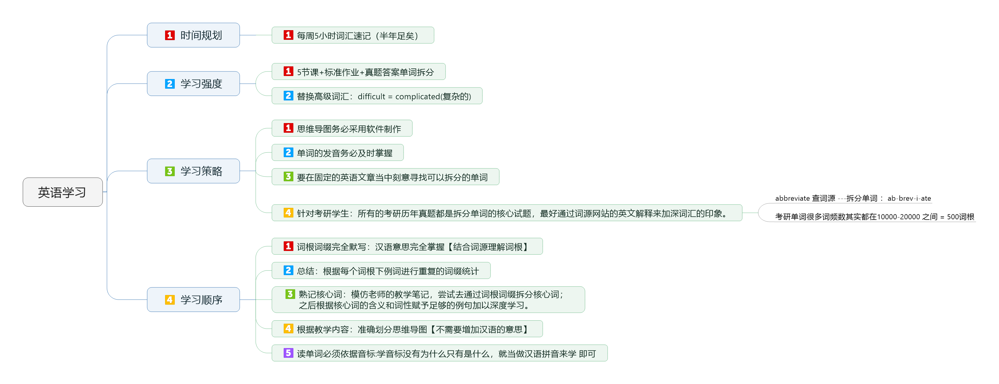

[English](README.en.md) | 简体中文   

    

##  介绍
你好，我是徐晓东，笔名[燕云长风](https://yanyunchangfeng.com)。大漠穷秋于 2019-03-16 21:22 赠此笔名。   
寓意：结合李白著名的边塞诗《关山月》取【燕云长风】—— 长风几万里，吹度玉门关。

##  学习计划贯穿全程

    

##  这是英语学习word文档和思维导图  
0.  [音标](src/assets/img/lesson0.png)  |  [音标详解](src/assets/img/lesson0-detail.png)  
1.  [vinc](src/assets/img/lesson1-vinc.png)  |  [vinc详解](src/assets/img/lesson1-detail-vinc.png)  
2.  [form1](src/assets/img/lesson2-form.png)  |  [form1详解](src/assets/img/lesson2-detail-form.png)    
3.  [form2](src/assets/img/lesson3-form.png)  |  [form2详解](src/assets/img/lesson3-detail-form.png)    
4.  [form3](src/assets/img/lesson4-form.png)  |  [form3详解](src/assets/img/lesson4-detail-form.png) | [prehend](src/assets/img/lesson4-prehend.png)  |  [prehend详解](src/assets/img/lesson4-detail-prehend.png)
5.  [struct](src/assets/img/lesson5-struct.png)  |  [struct详解](src/assets/img/lesson5-detail-struct.png)  | [od](src/assets/img/lesson5-od.png)  |  [od详解](src/assets/img/lesson5-detail-od.png)
6.  [bar](src/assets/img/lesson6-bar.png)   |  [bar详解](src/assets/img/lesson6-detail-bar.png) 
7.  [via](src/assets/img/lesson7-via.png)   |  [via详解](src/assets/img/lesson7-detail-via.png) |  [script](src/assets/img/lesson7-script.png)   |  [script详解](src/assets/img/lesson7-detail-script.png) |  [techno](src/assets/img/lesson7-techno.png)   |  [techno详解](src/assets/img/lesson7-detail-techno.png)  
8.  [press](src/assets/img/lesson8-press.png)   |  [press详解](src/assets/img/lesson8-detail-press.png) 
9.  [rect](src/assets/img/lesson9-rect.png)   |  [rect详解](src/assets/img/lesson9-detail-rect.png) 
10. [flux](src/assets/img/lesson10-flux.png)   |  [flux详解](src/assets/img/lesson10-detail-flux.png) 
11. [st1](src/assets/img/lesson11-st.png)   |  [st1详解](src/assets/img/lesson11-detail-st.png) 
12. [st2](src/assets/img/lesson12-st.png)   |  [st2详解上](src/assets/img/lesson12-detail-st-prev.png) |  [st详解2下](src/assets/img/lesson12-detail-st-next.png) 
13. [st3](src/assets/img/lesson13-st.png)   |  [st3详解上](src/assets/img/lesson13-detail-st-prev.png) |  [st详解3下](src/assets/img/lesson13-detail-st-next.png) 
14. [st4](src/assets/img/lesson14-st.png)   |  [st4详解](src/assets/img/lesson14-detail-st.png) 
15. [st5](src/assets/img/lesson15-st.png)   |  [st5详解](src/assets/img/lesson15-detail-st.png) 
16. [st6](src/assets/img/lesson16-st.png)   |  [st6详解上](src/assets/img/lesson16-detail-st-prev.png) |  [st详解6下](src/assets/img/lesson16-detail-st-next.png) 
17. [sit](src/assets/img/lesson17-sit.png)  |  [sit详解上](src/assets/img/lesson17-detail-sit-prev.png) |  [sit详解下](src/assets/img/lesson17-detail-sit-next.png) 
18. [pear](src/assets/img/lesson18-pear.png)  |  [pear详解](src/assets/img/lesson18-detail-pear.png) |  [mov](src/assets/img/lesson18-mov.png)  |  [mov详解](src/assets/img/lesson18-detail-mov.png) 
19. [cover](src/assets/img/lesson19-cover.png)  |  [cover详解](src/assets/img/lesson19-detail-cover.png) |  [plic1](src/assets/img/lesson19-plic.png)  |  [plic1详解](src/assets/img/lesson19-detail-plic.png) 
20. [plic2](src/assets/img/lesson20-plic.png)  |  [plic2详解](src/assets/img/lesson20-detail-plic.png) |  [mus](src/assets/img/lesson20-mus.png)  |  [mus详解](src/assets/img/lesson20-detail-mus.png) |  [erg1](src/assets/img/lesson20-erg.png)  |  [erg1详解](src/assets/img/lesson20-detail-erg.png) 
21. [erg2](src/assets/img/lesson21-erg.png)  |  [erg2详解](src/assets/img/lesson21-detail-erg.png) |  [lect1](src/assets/img/lesson21-lect.png)  |  [lect1详解](src/assets/img/lesson21-detail-lect.png) 
22. [lect2](src/assets/img/lesson22-lect.png)  |  [lect2详解上](src/assets/img/lesson22-detail-lect-prev.png) |  [lect2详解下](src/assets/img/lesson22-detail-lect-next.png) 
23. [nerv](src/assets/img/lesson23-nerv.png)  |  [nerv详解](src/assets/img/lesson23-detail-nerv.png) 
24. [path](src/assets/img/lesson24-path.png)  |  [path详解](src/assets/img/lesson24-detail-path.png)   |   [strict1](src/assets/img/lesson24-strict.png)  |  [strict1详解](src/assets/img/lesson24-detail-strict.png)  
25. [strict2](src/assets/img/lesson25-strict.png)  |  [strict2详解](src/assets/img/lesson25-detail-strict.png)  |  [vac](src/assets/img/lesson25-vac.png)  |  [vac详解](src/assets/img/lesson25-detail-vac.png) |  [ple](src/assets/img/lesson25-ple.png)  |  [ple详解](src/assets/img/lesson25-detail-ple.png) 
26. [medi](src/assets/img/lesson26-medi.png)  |  [medi详解](src/assets/img/lesson26-detail-medi.png) |  [preci](src/assets/img/lesson26-preci.png)  |  [preci详解](src/assets/img/lesson26-detail-preci.png) |[miss1](src/assets/img/lesson26-miss.png)  |  [miss1详解](src/assets/img/lesson26-detail-miss.png) 
27. [miss2](src/assets/img/lesson27-miss.png)  |  [miss2详解](src/assets/img/lesson27-detail-miss.png) 
28. [sci](src/assets/img/lesson28-sci.png)  |  [sci详解](src/assets/img/lesson28-detail-sci.png) |  [liter](src/assets/img/lesson28-liter.png)  |  [liter详解](src/assets/img/lesson28-detail-liter.png) |  [sum1](src/assets/img/lesson28-sum.png)  |  [sum1详解](src/assets/img/lesson28-detail-sum.png)  
29. [sum2](src/assets/img/lesson29-sum.png)  |  [sum2详解](src/assets/img/lesson29-detail-sum.png) |[spect1](src/assets/img/lesson29-spect.png)  |  [spect1详解](src/assets/img/lesson29-detail-spect.png)  
30. [spect2](src/assets/img/lesson30-spect.png)  |  [spect2详解上](src/assets/img/lesson30-detail-spect-prev.png) |  [spect2详解下](src/assets/img/lesson30-detail-spect-next.png) 
31. [spect3](src/assets/img/lesson31-spect.png) | [spect3详解](src/assets/img/lesson31-detail-spect.png) | [vis1](src/assets/img/lesson31-vis.png) | [vis1详解](src/assets/img/lesson31-detail-vis.png) 
32.  [vis2](src/assets/img/lesson32-vis.png) | [vis2详解](src/assets/img/lesson32-detail-vis.png) | [seri](src/assets/img/lesson32-seri.png) | [seri详解](src/assets/img/lesson32-detail-seri.png) | [lat1](src/assets/img/lesson32-lat.png) | [lat1详解](src/assets/img/lesson32-detail-lat.png) 
33. [lat2](src/assets/img/lesson33-lat.png) | [lat2详解](src/assets/img/lesson33-detail-lat.png) | [sim1](src/assets/img/lesson33-sim.png) | [sim1详解](src/assets/img/lesson33-detail-sim.png)
34. [sim2](src/assets/img/lesson34-sim.png) | [sim2详解](src/assets/img/lesson34-detail-sim.png)  |  [descip](src/assets/img/lesson34-descip.png) | [descip详解](src/assets/img/lesson34-detail-descip.png) | [helic](src/assets/img/lesson34-helic.png) | [helic详解](src/assets/img/lesson34-detail-helic.png)  |  [cept1](src/assets/img/lesson34-cept.png) | [cept1详解](src/assets/img/lesson34-detail-cept.png)  
35. [cept2](src/assets/img/lesson35-cept.png) | [cept2详解](src/assets/img/lesson35-detail-cept.png)  
## 我的个人博客  

* [燕云长风](https://yanyunchangfeng.com) 

## 我参与的系列项目

1. [NiceFish]( https://gitee.com/mumu-osc/NiceFish)：美人鱼，这是一个微型Blog系统，前端基于Angular7.0 + PrimeNG7.1.0。（GVIP 码云最有价值的开源项目 3333 ☆)
2. [NiceFish-React]( https://gitee.com/mumu-osc/NiceFish-React)：这是React版的实现，和 NiceFish Angular 版本保持风格一致。采用React Hooks 16.8.3 版本，使用TypeScript、Ant Design组件库以及Bootstrap v4.2.1 开发。  (7 ☆)
3. [OpenWMS-Frontend](https://gitee.com/mumu-osc/OpenWMS-Frontend)：OpenWMS项目前端基于 Angular 7.0 + PrimeNG 7.1.0。  (已推荐 204 ☆)
4. [nicefish-spring-cloud](https://gitee.com/mumu-osc/nicefish-spring-cloud)：这是NiceFish的服务端代码，基于SpringCloud。已经完成了一些基本的功能，如 SpringSecurity+OAuth2+JWT 实现SSO，文章、用户、评论等的分页查询等。如果你需要与这个后端代码进行对接，请检出本项目的 for-spring-cloud 分支。 (已推荐 126 ☆)
 

## 我的社交主页

1.  [燕云长风知乎](https://zhihu.com/people/hbxyxuxiaodong)  
2.  [燕云长风知乎专栏](https://zhuanlan.zhihu.com/yanyunchangfeng) 
3.  [燕云长风github](https://github.com/yanyunchangfeng)  
4.  [燕云长风gitee](https://gitee.com/yanyunchangfeng)  
5.  [燕云长风twitter](https://twitter.com/yanyunchangfeng)  
6.  [燕云长风medium](https://medium.com/@yanyunchangfeng)  
7.  [燕云长风facebook](https://facebook.com/yanyunchangfeng)  
8.  [燕云长风stackoverflow](http://stackoverflow.com/users/11366314)  
9.  [燕云长风npm](https://npmjs.com/~yanyunchangfeng)  
10. [燕云长风linkedin](https://www.linkedin.com/in/yanyunchangfeng)  
11. [燕云长风youtube](https://www.youtube.com/channel/UCaz2-l8Bd8tTBf1q-2ww7VA)  
12. [燕云长风gmail](mailto:yanyunchangfeng@gamil.com)  
 
## 开源许可证

MIT