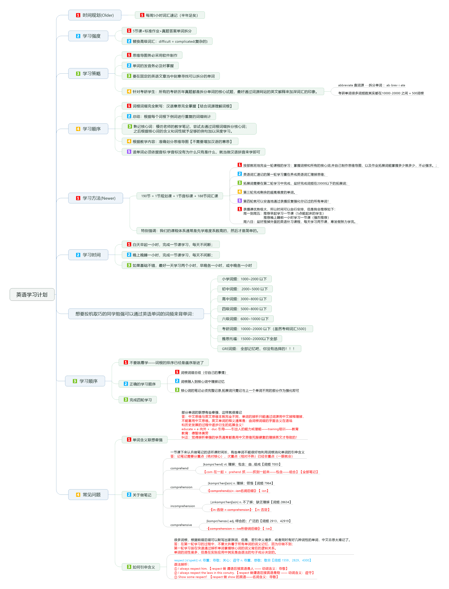
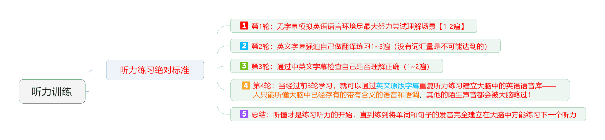

[English](README.en.md) | 简体中文   

    

##  介绍
你好，我是[燕云长风](https://yanyunchangfeng.github.io)。
寓意：结合李白著名的边塞诗《关山月》取【燕云长风】—— 长风几万里，吹度玉门关。

##  学习计划贯穿全程

    

  

##  听力训练

    

##  这是英语学习word文档和思维导图  
0.  [音标](src/assets/img/lesson0.png)  |  [音标详解](src/app/lesson0/lesson0-detail.pdf)  
1.  [vinc](src/app/lesson1/lesson1-vinc.pdf)  |  [vinc详解](src/app/lesson1/lesson1-detail-vinc.pdf)  
2.  [form1](src/app/lesson2/lesson2-form.pdf)  |  [form1详解](src/app/lesson2/lesson2-detail-form.pdf)    
3.  [form2](src/app/lesson3/lesson3-form.pdf)  |  [form2详解](src/app/lesson3/lesson3-detail-form.pdf)    
4.  [form3](src/app/lesson4/lesson4-form.pdf)  |  [form3详解](src/app/lesson4/lesson4-detail-form.pdf) | [prehend](src/app/lesson4/lesson4-prehend.pdf)  |  [prehend详解](src/app/lesson4/lesson4-detail-prehend.pdf)
5.  [struct](src/app/lesson5/lesson5-struct.pdf)  |  [struct详解](src/app/lesson5/lesson5-detail-struct.pdf)  | [od](src/app/lesson5/lesson5-od.pdf)  |  [od详解](src/app/lesson5/lesson5-detail-od.pdf)
6.  [bar1](src/app/lesson6/lesson6-bar.pdf)   |  [bar1详解](src/app/lesson6/lesson6-detail-bar.pdf) 
7.  [bar2](src/app/lesson7/lesson7-bar.pdf)   |  [bar2详解](src/app/lesson7/lesson7-detail-bar.pdf)  |  [via](src/app/lesson7/lesson7-via.pdf)   |  [via详解](src/app/lesson7/lesson7-detail-via.pdf)  
8.  [script](src/app/lesson8/lesson8-script.pdf)   |  [script详解](src/app/lesson8/lesson8-detail-script.pdf) |  [techno](src/app/lesson8/lesson8-techno.pdf)   |  [techno详解](src/app/lesson8/lesson8-detail-techno.pdf) |  [press](src/app/lesson8/lesson8-press.pdf)   |  [press详解](src/app/lesson8/lesson8-detail-press.pdf) 
9.  [rect1](src/app/lesson9/lesson9-rect.pdf)   |  [rect1详解](src/app/lesson9/lesson9-detail-rect.pdf) 
10. [rect2](src/app/lesson10/lesson10-rect.pdf)   |  [rect2详解](src/app/lesson10/lesson10-detail-rect.pdf)  |  [flux1](src/app/lesson10/lesson10-flux.pdf)   |  [flux1详解](src/app/lesson10/lesson10-detail-flux.pdf) 
11. [flux2](src/app/lesson/lesson11-flux.pdf)   |  [flux2详解](src/app/lesson/lesson11-detail-flux.pdf)  |  [st1](src/app/lesson/lesson11-st.pdf)   |  [st1详解](src/app/lesson/lesson11-detail-st.pdf) 
12. [st2](src/app/lesson/lesson12-st.pdf)   |  [st2详解上](src/app/lesson/lesson12-detail-st-prev.pdf) |  [st详解2下](src/app/lesson/lesson12-detail-st-next.pdf) 
13. [st3](src/app/lesson/lesson13-st.pdf)   |  [st3详解上](src/app/lesson/lesson13-detail-st-prev.pdf) |  [st详解3下](src/app/lesson/lesson13-detail-st-next.pdf) 
14. [st4](src/app/lesson/lesson14-st.pdf)   |  [st4详解](src/app/lesson/lesson14-detail-st.pdf) 
15. [st5](src/app/lesson/lesson15-st.pdf)   |  [st5详解](src/app/lesson/lesson15-detail-st.pdf) 
16. [st6](src/app/lesson/lesson16-st.pdf)   |  [st6详解上](src/app/lesson/lesson16-detail-st-prev.pdf) |  [st详解6下](src/app/lesson/lesson16-detail-st-next.pdf) 
17. [sit](src/app/lesson/lesson17-sit.pdf)  |  [sit详解上](src/app/lesson/lesson17-detail-sit-prev.pdf) |  [sit详解下](src/app/lesson/lesson17-detail-sit-next.pdf) 
18. [pear](src/app/lesson/lesson18-pear.pdf)  |  [pear详解](src/app/lesson/lesson18-detail-pear.pdf) |  [mov](src/app/lesson/lesson18-mov.pdf)  |  [mov详解](src/app/lesson/lesson18-detail-mov.pdf) 
19. [cover](src/app/lesson/lesson19-cover.pdf)  |  [cover详解](src/app/lesson/lesson19-detail-cover.pdf) |  [plic1](src/app/lesson/lesson19-plic.pdf)  |  [plic1详解](src/app/lesson/lesson19-detail-plic.pdf) 
20. [plic2](src/app/lesson/lesson20-plic.pdf)  |  [plic2详解](src/app/lesson/lesson20-detail-plic.pdf) |  [mus](src/app/lesson/lesson20-mus.pdf)  |  [mus详解](src/app/lesson/lesson20-detail-mus.pdf) |  [erg1](src/app/lesson/lesson20-erg.pdf)  |  [erg1详解](src/app/lesson/lesson20-detail-erg.pdf) 
21. [erg2](src/app/lesson/lesson21-erg.pdf)  |  [erg2详解](src/app/lesson/lesson21-detail-erg.pdf) |  [lect1](src/app/lesson/lesson21-lect.pdf)  |  [lect1详解](src/app/lesson/lesson21-detail-lect.pdf) 
22. [lect2](src/app/lesson/lesson22-lect.pdf)  |  [lect2详解上](src/app/lesson/lesson22-detail-lect-prev.pdf) |  [lect2详解下](src/app/lesson/lesson22-detail-lect-next.pdf) 
23. [nerv](src/app/lesson/lesson23-nerv.pdf)  |  [nerv详解](src/app/lesson/lesson23-detail-nerv.pdf) 
24. [path](src/app/lesson/lesson24-path.pdf)  |  [path详解](src/app/lesson/lesson24-detail-path.pdf)   |   [strict1](src/app/lesson/lesson24-strict.pdf)  |  [strict1详解](src/app/lesson/lesson24-detail-strict.pdf)  
25. [strict2](src/app/lesson/lesson25-strict.pdf)  |  [strict2详解](src/app/lesson/lesson25-detail-strict.pdf)  |  [vac](src/app/lesson/lesson25-vac.pdf)  |  [vac详解](src/app/lesson/lesson25-detail-vac.pdf) |  [ple](src/app/lesson/lesson25-ple.pdf)  |  [ple详解](src/app/lesson/lesson25-detail-ple.pdf) 
26. [medi](src/app/lesson/lesson26-medi.pdf)  |  [medi详解](src/app/lesson/lesson26-detail-medi.pdf) |  [preci](src/app/lesson/lesson26-preci.pdf)  |  [preci详解](src/app/lesson/lesson26-detail-preci.pdf) |[miss1](src/app/lesson/lesson26-miss.pdf)  |  [miss1详解](src/app/lesson/lesson26-detail-miss.pdf) 
27. [miss2](src/app/lesson/lesson27-miss.pdf)  |  [miss2详解](src/app/lesson/lesson27-detail-miss.pdf) 
28. [sci](src/app/lesson/lesson28-sci.pdf)  |  [sci详解](src/app/lesson/lesson28-detail-sci.pdf) |  [liter](src/app/lesson/lesson28-liter.pdf)  |  [liter详解](src/app/lesson/lesson28-detail-liter.pdf) |  [sum1](src/app/lesson/lesson28-sum.pdf)  |  [sum1详解](src/app/lesson/lesson28-detail-sum.pdf)  
29. [sum2](src/app/lesson/lesson29-sum.pdf)  |  [sum2详解](src/app/lesson/lesson29-detail-sum.pdf) |[spect1](src/app/lesson/lesson29-spect.pdf)  |  [spect1详解](src/app/lesson/lesson29-detail-spect.pdf)  
30. [spect2](src/app/lesson/lesson30-spect.pdf)  |  [spect2详解上](src/app/lesson/lesson30-detail-spect-prev.pdf) |  [spect2详解下](src/app/lesson/lesson30-detail-spect-next.pdf) 
31. [spect3](src/app/lesson/lesson31-spect.pdf) | [spect3详解](src/app/lesson/lesson31-detail-spect.pdf) | [vis1](src/app/lesson/lesson31-vis.pdf) | [vis1详解](src/app/lesson/lesson31-detail-vis.pdf) 
32.  [vis2](src/app/lesson/lesson32-vis.pdf) | [vis2详解](src/app/lesson/lesson32-detail-vis.pdf) | [seri](src/app/lesson/lesson32-seri.pdf) | [seri详解](src/app/lesson/lesson32-detail-seri.pdf) | [lat1](src/app/lesson/lesson32-lat.pdf) | [lat1详解](src/app/lesson/lesson32-detail-lat.pdf) 
33. [lat2](src/app/lesson/lesson33-lat.pdf) | [lat2详解](src/app/lesson/lesson33-detail-lat.pdf) | [sim1](src/app/lesson/lesson33-sim.pdf) | [sim1详解](src/app/lesson/lesson33-detail-sim.pdf)
34. [sim2](src/app/lesson/lesson34-sim.pdf) | [sim2详解](src/app/lesson/lesson34-detail-sim.pdf)  |  [descip](src/app/lesson/lesson34-descip.pdf) | [descip详解](src/app/lesson/lesson34-detail-descip.pdf) | [helic](src/app/lesson/lesson34-helic.pdf) | [helic详解](src/app/lesson/lesson34-detail-helic.pdf)  |  [cept1](src/app/lesson/lesson34-cept.pdf) | [cept1详解](src/app/lesson/lesson34-detail-cept.pdf)  
35. [cept2](src/app/lesson/lesson35-cept.pdf) | [cept2详解](src/app/lesson/lesson35-detail-cept.pdf)  
36. [cept3](src/app/lesson/lesson36-cept.pdf) | [cept3详解](src/app/lesson/lesson36-detail-cept.pdf)  
37. [cept4](src/app/lesson/lesson37-cept.pdf) | [cept4详解](src/app/lesson/lesson37-detail-cept.pdf)  |   [sert](src/app/lesson/lesson37-sert.pdf) | [sert详解](src/app/lesson/lesson37-detail-sert.pdf)  |   [duct1](src/app/lesson/lesson37-duct.pdf) | [duct1详解](src/app/lesson/lesson37-detail-duct.pdf)  
38. [duct2](src/app/lesson/lesson38-duct.pdf) | [duct2详解](src/app/lesson/lesson38-detail-duct.pdf)  |   [peri](src/app/lesson/lesson38-peri.pdf) | [peri详解](src/app/lesson/lesson38-detail-peri.pdf) 
39. [scen](src/app/lesson/lesson39-scen.pdf) | [scen详解](src/app/lesson/lesson39-detail-scen.pdf)  |   [journ](src/app/lesson/lesson39-journ.pdf) | [journ详解](src/app/lesson/lesson39-detail-journ.pdf) |   [circ](src/app/lesson/lesson39-circ.pdf) | [circ详解](src/app/lesson/lesson39-detail-circ.pdf)  
40.  [part1](src/app/lesson/lesson40-part.pdf) | [part1详解](src/app/lesson/lesson40-detail-part.pdf)  
41.  [part2](src/app/lesson/lesson41-part.pdf) | [part2详解](src/app/lesson/lesson41-detail-part.pdf)   |   [vent](src/app/lesson/lesson41-vent.pdf) | [vent详解](src/app/lesson/lesson41-detail-vent.pdf)   |   [haust](src/app/lesson/lesson41-haust.pdf) | [haust详解](src/app/lesson/lesson41-detail-haust.pdf)  
42.  [tra1](src/app/lesson/lesson42-part.pdf) | [tra1详解](src/app/lesson/lesson42-detail-tra.pdf) 
43.  [tra2](src/app/lesson/lesson43-part.pdf) | [tra2详解](src/app/lesson/lesson43-detail-tra.pdf)  |   [loc](src/app/lesson/lesson43-loc.pdf) | [loc详解](src/app/lesson/lesson43-detail-loc.pdf)   |   [urb](src/app/lesson/lesson43-urb.pdf) | [urb详解](src/app/lesson/lesson43-detail-urb.pdf)   |   [fortun](src/app/lesson/lesson43-fortun.pdf) | [fortun详解](src/app/lesson/lesson43-detail-fortun.pdf)   |   [torn](src/app/lesson/lesson43-torn.pdf) |  [torn详解](src/app/lesson/lesson43-detail-torn.pdf)  
44. [noc](src/app/lesson/lesson44-noc.pdf) | [noc详解](src/app/lesson/lesson44-detail-noc.pdf)  |   [proach](src/app/lesson/lesson44-proach.pdf) | [proach详解](src/app/lesson/lesson44-detail-proach.pdf)  |   [gorg](src/app/lesson/lesson44-gorg.pdf) | [gorg详解](src/app/lesson/lesson44-detail-gorg.pdf)  |   [arch](src/app/lesson/lesson44-arch.pdf) | [arch详解](src/app/lesson/lesson44-detail-arch.pdf)  
45. [fess](src/app/lesson/lesson45-fess.pdf)  |  [fess详解](src/app/lesson/lesson45-detail-fess.pdf)  |   [manu](src/app/lesson/lesson45-manu.pdf)  |  [manu详解](src/app/lesson/lesson45-detail-fess.pdf)   |   [fasc](src/app/lesson/lesson45-fasc.pdf)  |  [fasc详解](src/app/lesson/lesson45-detail-fasc.pdf)   
46. [viv](src/app/lesson/lesson46-viv.pdf)  |  [fess详解](src/app/lesson/lesson46-detail-viv.pdf) |  [tact1](src/app/lesson/lesson46-tact.pdf)  |  [tact1详解](src/app/lesson/lesson46-detail-tact.pdf) 
47. [tact2](src/app/lesson/lesson47-tact.pdf)  |  [tact2详解](src/app/lesson/lesson47-detail-tact.pdf)   |   [liqu](src/app/lesson/lesson47-liqu.pdf)  |  [liqu详解](src/app/lesson/lesson47-detail-liqu.pdf)   |   [pand](src/app/lesson/lesson47-pand.pdf)  |  [pand详情](src/app/lesson/lesson47-detail-pand.pdf)   |   [mix](src/app/lesson/lesson47-mix.pdf)  |  [mix详情](src/app/lesson/lesson47-detail-mix.pdf)     |   [electr1](src/app/lesson/lesson47-electr.pdf)  |  [electr1详情](src/app/lesson/lesson47-detail-electr.pdf)   
48. [electr2](src/app/lesson/lesson48-electr.pdf)  |  [electr2详情](src/app/lesson/lesson48-detail-electr.pdf)   |   [clud1](src/app/lesson/lesson48-clud.pdf)  |  [clud1详情](src/app/lesson/lesson48-detail-clud.pdf)   
49.   [clud2](src/app/lesson/lesson49-clud.pdf)  |  [clud2详情](src/app/lesson/lesson49-detail-clud.pdf)   

## 系列项目

|  名称   | 描述  | Stars  |
|  ----  | ----  | ----  |
| [NiceFish（美人鱼）](http://git.oschina.net/mumu-osc/NiceFish/)  | 这是一个系列项目，目标是示范前后端分离的开发模式:前端浏览器、移动端、Electron 环境中的各种开发模式。后端有两个版本：SpringBoot 版本和 SpringCloud 版本 |  <a href='https://gitee.com/mumu-osc/NiceFish/stargazers'></img></a>  |
| [NiceFish-React](https://gitee.com/mumu-osc/NiceFish-React)  |  这是React 版本，基于React 18.2.0 ，使用 Antd、Inversify、 定制版 Bootstrap开发。 | <a href='https://gitee.com/mumu-osc/NiceFish-React/stargazers'></img></a> |
| [nicefish-ionic](http://git.oschina.net/mumu-osc/nicefish-ionic)  | 这是一个移动端的 demo，基于 ionic，此项目已支持 PWA。| <a href='https://gitee.com/mumu-osc/nicefish-ionic/stargazers'></img></a> |
| [NiceBlogElectron](https://gitee.com/mumu-osc/NiceBlogElectron)  | 这是一个基于 Electron 的桌面端项目，把 NiceFish 用 Electron 打包成了一个桌面端运行的程序。这是由 ZTE 中兴通讯的前端道友提供的，我 fork 了一个，有几个 node 模块的版本号老要改，如果您正在研究如何利用 Electron 开发桌面端应用，请参考这个项目。 | <a href='https://gitee.com/mumu-osc/NiceBlogElectron/stargazers'></img></a> |
| [nicefish-spring-boot](https://gitee.com/mumu-osc/nicefish-spring-boot)  | 用来示范前后端分离模式下，前端代码与后端服务的对接方式，已经完成了基线版本。以此为基础，你可以继续开发出适合自己业务场景的代码。| <a href='https://gitee.com/mumu-osc/nicefish-spring-boot/stargazers'></img></a> |
| [nicefish-spring-cloud](https://gitee.com/mumu-osc/nicefish-spring-cloud)  | 用来示范前后端分离模式下，前端代码与分布式后端服务的对接方式。  | <a href='https://gitee.com/mumu-osc/nicefish-spring-cloud/stargazers'></img></a> |
| [OpenWMS](https://gitee.com/mumu-osc/OpenWMS-Frontend)  | 用来示范管理后台型系统的开发模式。| <a href='https://gitee.com/mumu-osc/OpenWMS-Frontend/stargazers'></img></a> |  

## 社交主页

-  [燕云长风github](https://github.com/yanyunchangfeng)  
## 开源许可证

MIT